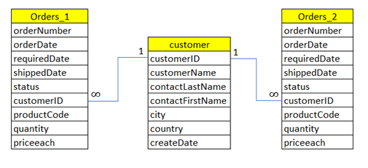

# Project Data Analysis for B2B Retail: Customer Analytics Report
 
This repository is used to demonstrate my skill in SQL. This project was initiated by DQLab

### Dataset Brief
The table that will be used in this project are as follows.

<ol>
    <li>Table orders_1 : Contains data related to sales transactions for the quarter 1 period (Jan – Mar 2004)</li>
    <li>Orders_2 Table : Contains data related to sales transactions for the 2nd quarter period (Apr – Jun 2004)</li>
    <li>Customer table: Contains data on customer profiles who register as xyz.com customers</li>
</ol>

